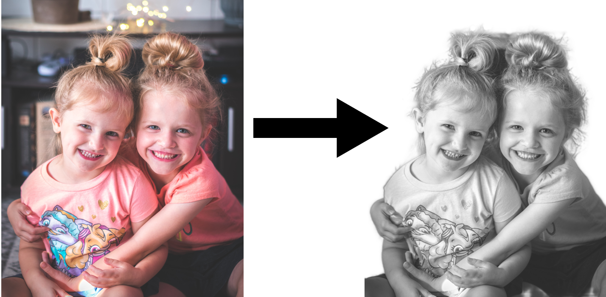

# image_matting

Removal of unwanted outer areas from a graphic or illustrated image; this process usually consists of removing some 
of the peripheral regions of an image to remove extraneous trash from the picture, improving its framing, and 
accentuating or isolating the subject matter from its background.

Here, we have a web application that uses artificial intelligence to remove the background of any image or photo. 
It works 100% automatically, so you don't need to select the background/foreground layers to separate them manually - 
choose or select your image and instantly download the output image with the background removed.

